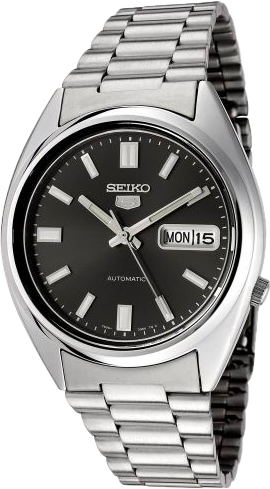

## Seiko 5

### Where to buy
***

[](https://www.chrono24.it/search/index.htm?countryIds=AT&countryIds=BE&countryIds=BG&countryIds=CY&countryIds=CZ&countryIds=DE&countryIds=DK&countryIds=EE&countryIds=ES&countryIds=FI&countryIds=FR&countryIds=GF&countryIds=GP&countryIds=GR&countryIds=HR&countryIds=HU&countryIds=IE&countryIds=IT&countryIds=LT&countryIds=LU&countryIds=LV&countryIds=MC&countryIds=MT&countryIds=NL&countryIds=PL&countryIds=PT&countryIds=RE&countryIds=RO&countryIds=SE&countryIds=SI&countryIds=SK&currencyId=CHF&dosearch=true&manufacturerIds=226&maxAgeInDays=0&models=848&pageSize=60&redirectToSearchIndex=true&resultview=block&sortorder=1&year=1990&year=1990&year=1990&year=1991&year=1991&year=1991&year=1992&year=1992&year=1992&year=1993&year=1993&year=1993&year=1994&year=1994&year=1994&year=1995&year=1995&year=1995&year=1996&year=1996&year=1996&year=1997&year=1997&year=1997&year=1998&year=1998&year=1998&year=1999&year=1999&year=1999&year=2000&year=2001&year=2002&year=2003&year=2004&year=2005&year=2006&year=2007&year=2008&year=2009&year=2010&year=2011&year=2012&year=2013&year=2014&year=2015&year=2016&year=2017&year=2018&year=2019){:target="_blank"}

{:target="_blank"}

{:target="_blank"}